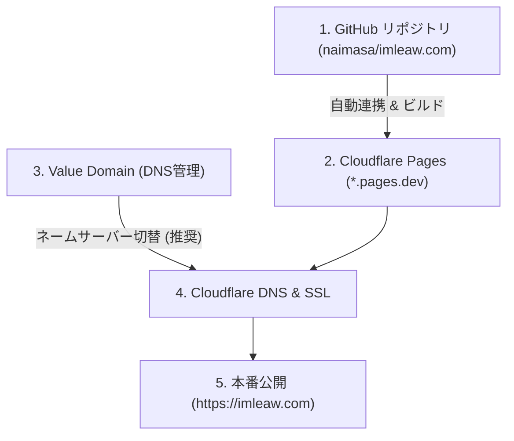

# Cloudflare Pages 移行・デプロイ・DNS設定ガイド (imleaw.com)

本書は、WordPress から Astro へ移行した `imleaw.com` を **Cloudflare Pages** へ本番デプロイし、**Value Domain** で管理している独自ドメイン（`imleaw.com` / `www.imleaw.com`）を接続して安全にサイトを公開・運用するための完全手順書です。

---

## 📋 全体フロー概要



---

## 🛠️ 事前準備

| 項目 | 必要なもの / 確認事項 |
| :--- | :--- |
| **GitHub リポジトリ** | `https://github.com/naimasa/imleaw.com` に最新コードがプッシュされていること |
| **Cloudflare アカウント** | 無料アカウント（[cloudflare.com](https://dash.cloudflare.com/)） |
| **Value Domain アカウント** | `imleaw.com` ドメインを契約・管理しているアカウント |

---

## Step 1: Cloudflare Pages にプロジェクトを作成・デプロイ

### 1-1. GitHub との連携
1. [Cloudflare ダッシュボード](https://dash.cloudflare.com/) にログインします。
2. 左メニューから **「コンピュート (Workers & Pages)」 >「概要」**（または **「Pages」**）を選択します。
3. **「作成」 >「Pages」 >「Git に接続」** をクリックします。
4. GitHub アカウントを認証し、対象リポジトリ **`naimasa/imleaw.com`** を選択して **「セットアップを開始」** をクリックします。

### 1-2. ビルド設定
以下の設定値を入力します：

| 設定項目 | 入力値 | 備考 |
| :--- | :--- | :--- |
| **プロジェクト名** | `imleaw-com` | （デフォルトのままでOK） |
| **本番環境ブランチ** | `main` | |
| **フレームワークのプリセット** | `None` （または `Astro`） | |
| **ビルドコマンド** | `npm run build` | Pagefindインデックス・リダイレクト生成まで自動実行されます |
| **ビルド出力ディレクトリ** | `dist` | |

### 1-3. 環境変数の設定（推奨）
**「環境変数 (高度)」** を開き、以下を追加します：
- 変数名: `NODE_VERSION`
- 値: `20` （または `22`）

### 1-4. 初回デプロイの実行
- **「保存してデプロイ」** をクリックします。
- 1〜2分ほどでビルドが完了し、`https://imleaw-com.pages.dev` のような一時プレビュー URL が発行されます。
- ブラウザでアクセスし、トップページ・ブログ記事・検索画面（`/search`）が正常に動作することを確認します。

---

## Step 2: Cloudflare Pages にカスタムドメインを登録

1. 作成した Cloudflare Pages プロジェクト（`imleaw-com`）の管理画面を開きます。
2. 上部タブの **「カスタム ドメイン」** を選択します。
3. **「カスタム ドメインを設定」** ボタンをクリックします。
4. `imleaw.com` と入力し、**「ドメインの追加」** を進めます。
5. 同様に、必要に応じて `www.imleaw.com` も追加します。

---

## Step 3: Value Domain での DNS 設定変更

ドメインの接続には、**【方法 A: Cloudflare DNS 利用（最も推奨）】** と **【方法 B: Value Domain DNS のまま CNAME 設定】** の 2 通りがあります。
Cloudflare の高速 CDN・自動 SSL 証明書更新・Apex ドメイン（ルートドメイン）対応を最大限活かすため、**方法 A を強く推奨** します。

### 【推奨】方法 A: ネームサーバーを Cloudflare に切り替える（推奨）

#### A-1. Cloudflare でネームサーバー名を確認
1. Cloudflare ダッシュボードのトップから **「サイトを追加」**（Add site）をクリックします。
2. `imleaw.com` を入力し、**Free プラン** を選択して進めます。
3. 自動スキャンされた既存 DNS レコードを確認し、次へ進むと、**Cloudflare のネームサーバー 2 つ** が表示されます。
   *(例: `ada.ns.cloudflare.com`, `bob.ns.cloudflare.com` など)*

#### A-2. Value Domain 管理画面でネームサーバーを変更
1. [Value Domain コントロールパネル](https://www.value-domain.com/) にログインします。
2. 左メニュー **「ドメイン」 >「ドメインの設定操作」** を開きます。
3. 対象ドメイン `imleaw.com` の右側にある **「ネームサーバー」** ボタンをクリックします。
4. **「当サービス以外のネームサーバーを使う」** を選択（または直接入力）し、Cloudflare から指定されたネームサーバーを入力します：
   - **ネームサーバー 1**: `(Cloudflare から指定されたサーバー 1)`
   - **ネームサーバー 2**: `(Cloudflare から指定されたサーバー 2)`
   - （3〜5 は空欄でOKです）
5. **「保存する」** をクリックします。

> [!NOTE]
> ネームサーバーの変更が世界中の DNS に反映されるまで、通常数十分〜最大24時間程度かかります。反映されると Cloudflare から「Status: Active」の通知メールが届きます。

---

### 【代替】方法 B: Value Domain の DNS レコードを直接編集する場合

Value Domain のネームサーバーをそのまま使い続けたい場合の手順です：

1. Value Domain コントロールパネルで **「ドメイン」 >「DNS情報/URL転送の変更」** を開きます。
2. `imleaw.com` の DNS 設定欄に以下のように記述します：

```text
cname www imleaw-com.pages.dev.
a @ (Cloudflare Pages の指定IPアドレス、または URL転送設定)
```

> [!WARNING]
> Value Domain DNS ではルートドメイン（`imleaw.com`）への CNAME 設定（CNAME フラットニング）に制限がある場合があります。そのため、トラブルが起きにくい **方法 A（ネームサーバー変更）** を推奨します。

---

## Step 4: 切り替え後の動作検証チェックリスト

DNS 反映後、以下の項目を順番にブラウザでテストします：

- [ ] **HTTPS 接続**: `https://imleaw.com/` で鍵マーク（有効な SSL 証明書）が表示されること
- [ ] **トップページ**: ヒーロー・Instagram カード・パン教室案内が正しく表示されること
- [ ] **パン教室・固定ページ**:
  - `/about-the-lesson/`
  - `/basic-course/`
  - `/advanced-course/`
  - `/%e9%ab%98%e5%8a%a0%e6%b0%b4%e3%83%91%e3%83%b3%e3%82%b3%e3%83%bc%e3%82%b9/`
  - `/who-am-i/`
  - `/en/` （英語案内ページ）
- [ ] **ブログ記事 (431件)**: 過去の WordPress 記事（日本語URL含む）が正しく開けること
- [ ] **画像・メディア**: 過去の `wp-content/uploads/` 経由の画像が正常に表示またはリダイレクトされること
- [ ] **サイト内検索**: `/search/` にアクセスし、日本語キーワード検索が即座に動作すること
- [ ] **サイトマップ**: `https://imleaw.com/sitemap-index.xml` および `https://imleaw.com/sitemap.xml` が正常にレスポンスを返すこと
- [ ] **RSS フィード**: `https://imleaw.com/feed/` にアクセスできること

---

## Step 5: Decap CMS（管理画面）の利用方法

静的サイト公開後、ブラウザからブログ記事や Instagram 埋め込みリンクの更新を行う場合：

1. `https://imleaw.com/admin/` にアクセスします。
2. GitHub アカウントでログインします。
3. 記事の新規作成・編集や、Instagram ポスト URL の追加・並び替えを行い「Publish」すると、GitHub へコミットされ、Cloudflare Pages が自動で数分以内に再ビルド・公開します。

---

## 🚑 緊急時のロールバック（切り戻し）手順

万が一、旧 WordPress サイトに一時的に戻す必要がある場合の手順です：

1. **Value Domain のネームサーバー変更画面** を開きます。
2. **「Value Domain 標準ネームサーバーに戻す」**（`ns1.value-domain.com` 〜 `ns5.value-domain.com`）を選択して保存します。
3. **「DNS情報/URL転送の変更」** 画面で、旧 WordPress サーバー（レンタルサーバー等）の IP アドレスが向いていることを確認します。
4. 通常 10分〜数時間で旧 WordPress サーバーへのアクセスに戻ります。
